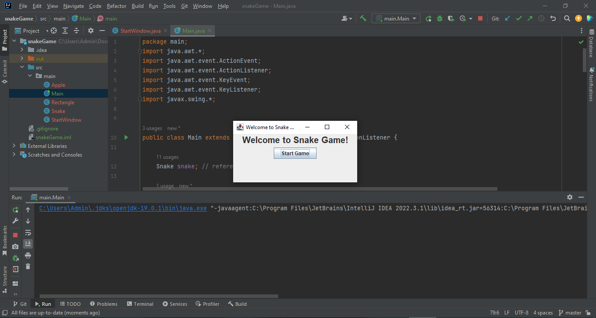
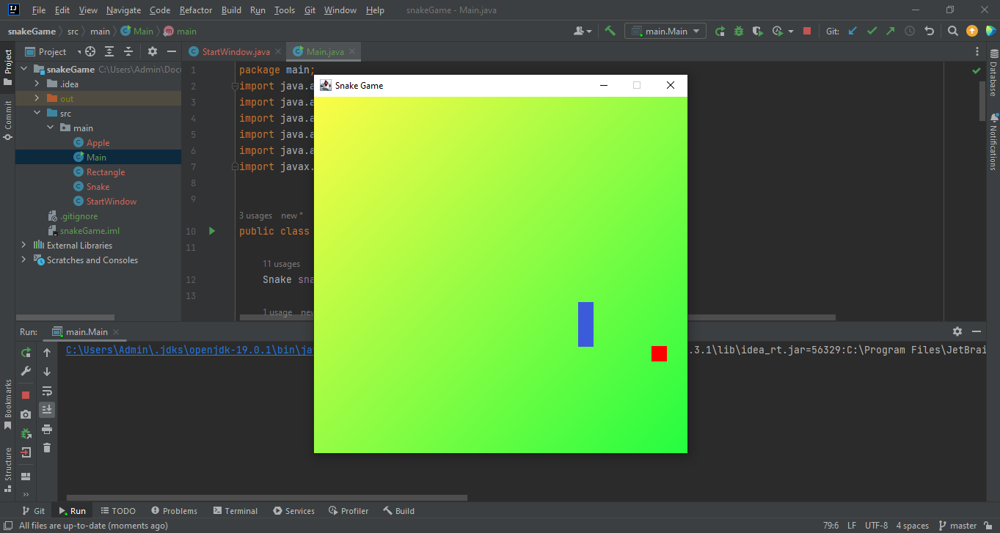
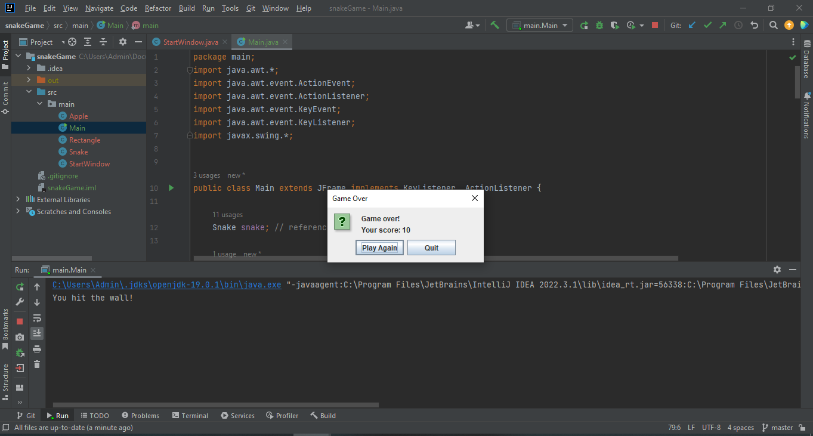

# snakeGame

## Snake Game in Java 2D

The Java Snake Game code in this repository was created using a tutorial by [Java Coding Community] available on [https://www.youtube.com/watch?v=7t5uwECup4I&t=658s]. 
The tutorial provides step-by-step instructions for building a basic Snake Game using Java.
The code in this repository has been modified and updated to include additional features.

## Project screenshots:

*Start-game*

  
 

 
 *Play*

  

 *Game-over*

  

## Setup Instructions:

* Import the project into your preferred Java IDE.
* Run the Main class to start the Snake Game.

Note: This is a Java learning project, there could be bugs and flaws.
